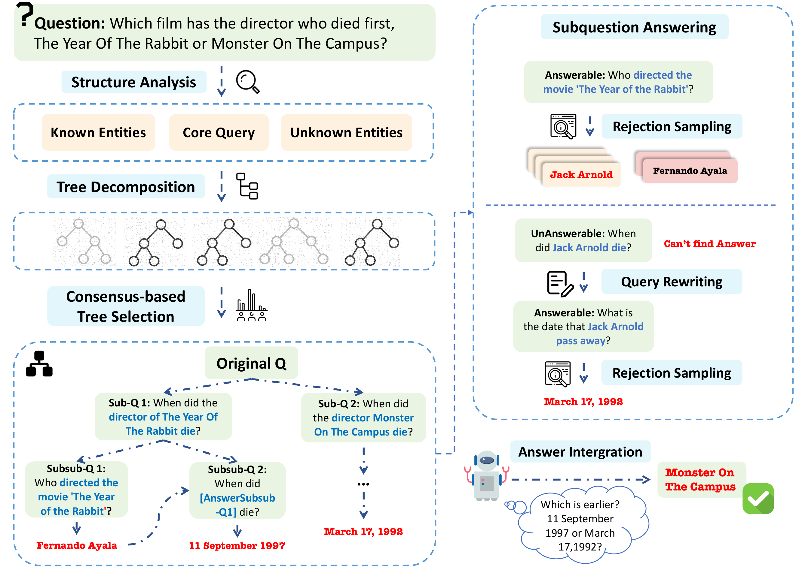

# 🧠🌳Reasoning in Trees: Improving Retrieval-Augmented Generation for Multi-Hop Question Answering


## 🔍 What is RT-RAG? 

**RT-RAG** systematically decomposes complex multi-hop questions into explicit **binary reasoning trees**. It leverages structured entity analysis and **consensus-based tree selection** to ensure e decomposition, clearly separating core queries, known entities, and unknown targets.

Once the tree is built, a **bottom-up traversal strategy** is used to iteratively rewrite and refine sub-questions. This process efficiently collects high-quality evidence while mitigating error propagation through recursive reasoning.


---

## ⚙️ 1. Environment Setup

### ✅ Install Dependencies

```bash
pip install -r requirements.txt
```

### ⚡️ (Optional) Serve Qwen2.5-14B-Instruct via vLLM

To serve Qwen2.5-14B-Instruct locally using [vLLM](https://github.com/vllm-project/vllm) with OpenAI-compatible API:

First, install vLLM:

```bash
pip install vllm
```

Then, start the server:

```bash
vllm serve Qwen/Qwen2.5-14B-Instruct \
  --dtype auto \
  --api-key your-api-key
```

> Replace `your-api-key` with a secure token. This key must match what you configure in `config.py`.

📝 **Tip:** For more details, see [vLLM OpenAI-Compatible Server Docs](https://docs.vllm.ai/en/latest/serving/openai_compatible_server.html)


---

## 📦 2. Model Downloads

You can download models manually or use Hugging Face CLI:

### 🔍 Reranker Model

- [BAAI/bge-reranker-base](https://huggingface.co/BAAI/bge-reranker-base)

```bash
huggingface-cli download BAAI/bge-reranker-base
```

### 🧠 Language Model (Qwen2.5-14B-Instruct)

- [Qwen/Qwen2.5-14B-Instruct](https://huggingface.co/Qwen/Qwen2.5-14B-Instruct)

```bash
huggingface-cli download Qwen/Qwen2.5-14B-Instruct
```

> Make sure to login if authentication is required:

```bash
huggingface-cli login
```

---

## 🛠️ 3. Data Preparation

The preprocessed corpus is already in the `raw` folder.  
Evaluation and retrieval data are from [LongBench](https://github.com/THUDM/LongBench).

---

## ✏️ 4. Configure `main/build_dense_index/config.py`

Update your configuration for embedding/index building:

| Parameter       | Description |
|----------------|-------------|
| `raw_path`     | Path to folder containing preprocessed JSON |
| `save_path`    | Where to store FAISS index & metadata |
| `dataset_name` | Filename without `.json` |
| `chunk_size`   | Max words per chunk (e.g., 200) |
| `min_sentence` | Min sentences per chunk (e.g., 2) |
| `overlap`      | Overlapping sentences between chunks (e.g., 2) |
| `base_url`     | API endpoint (e.g., `http://localhost:8000/v1`) |
| `api_key`      | Your API key used with the embedding service |

---

## 🧱 5. Build the Dense Index

Once `main/build_dense_index/config.py` is ready, build your FAISS index with:

```bash
python build_dense_index/dense_build_index.py
```

---

---

## 🧪 6. Run on the Full Dataset

After the dense index is successfully built:

1. Configure runtime parameters in:

    ```text
    main/config.py
    ```

    Make sure the dataset path, retrieval settings, API credentials, and output paths are correct and aligned with the built index.

2. Run the full dataset through the system:

    ```bash
    python main/load_data.py
    ```

> This step runs the entire dataset through the RT-RAG pipeline: it performs retrieval, reranking, tree generation, and LLM querying.


---

---

## 📊 7. Evaluate the Results

Once inference on the full dataset is complete, you can evaluate the generated answers using:

```bash
python main/evaulate.py /path/to/result.txt
```
> Replace `/path/to/result.txt` with the actual path to the output file generated by `main/load_data.py`.

This script will compute metrics on the dataset.

## 📈 RT-RAG Performance

The table below summarizes RT-RAG's performance across three benchmark datasets using two different backbone models:

| Model           | Dataset     | F1     | EM     |
|----------------|-------------|--------|--------|
| **GPT-4o-mini** | MuSiQue     | 54.42  | 41.50  |
|                | 2WikiMQA    | 75.08  | 63.00  |
|                | HotpotQA    | 65.26  | 52.50  |
|                | **Average** | **64.92** | **52.33** |
| **Qwen2.5-14B** | MuSiQue     | 50.04  | 39.00  |
|                | 2WikiMQA    | 73.69  | 64.00  |
|                | HotpotQA    | 66.24  | 51.00  |
|                | **Average** | **63.32** | **51.33** |

> RT-RAG consistently outperforms all baselines across diverse multi-hop QA datasets.


